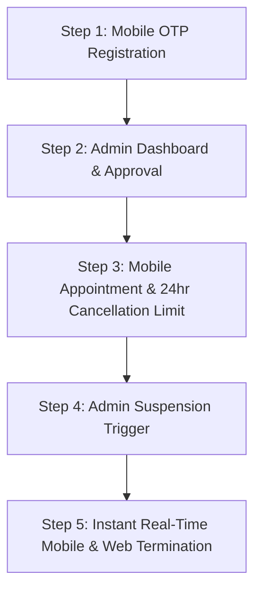

# 🏛️ CAPSTONE DEFENSE PRESENTATION MANUSCRIPT
## Project Title: Barangay Bulua Online Appointment and Complaint System
### Target Audience: Academic Examination Panel
---

# 📑 PART 1: SLIDE-BY-SLIDE DEFENSE SCRIPT

## 🖵 Slide 1: Title & Project Identity
*   **Visual Focus:** Official institutional branding of Barangay Bulua, Cagayan de Oro City. System screenshots inside high-fidelity mockups (Vite-React admin console on a laptop, Flutter resident app on a mobile device).
*   **Presenter Script:**
    > *"Good morning, esteemed members of the panel, our research adviser, and colleagues. Today, we are proud to present our capstone project, the **Barangay Bulua Online Appointment and Complaint System**.*
    >
    > *Barangay Bulua, as one of the major commercial and residential hubs in Cagayan de Oro City, handles hundreds of resident requests, documents, and community concerns daily. Our system is designed as a multi-platform digital governance portal that bridges the gap between the local administration and its constituents. By leveraging a high-performance web administration console built in React, and a premium mobile application built in Flutter, we have established a highly secure, real-time ecosystem that digitizes public service, ensures administrative accountability, and enforces strict security protocols."*

---

## 🖵 Slide 2: The Core Problem Statement
*   **Visual Focus:** A high-contrast bulleted layout dividing problems into three verticals: **Operational Friction**, **Accountability Gaps**, and **Session Security Vulnerabilities**.
*   **Presenter Script:**
    > *"To fully appreciate the necessity of this system, we must examine the operational bottlenecks faced by traditional barangay operations:*
    >
    > *1. **Operational Friction & Inefficiencies:** The traditional manual system forces residents to physically travel to the Barangay Hall to schedule appointments or file complaints. This leads to long queues, manual paper tracking, and lost documents.*
    > *2. **Communication Gaps:** Residents are left completely in the dark regarding the status of their complaints or scheduled bookings. There is no automated feedback loop, resulting in administrative lag.*
    > *3. **The Session Persistence & Account Suspension Vulnerability:** In typical web applications, once a user logs in, they are issued a token that remains valid for days. If an administrator suspends a resident due to system abuse, malicious reports, or fraudulent activity, the suspended user remains actively logged in until they manually log out or their token expires. This security loophole allows suspended accounts to continue filing false complaints and locking appointment slots, posing a severe threat to database integrity."*

---

## 🖵 Slide 3: The System Solution & Scope
*   **Visual Focus:** A high-level system diagram illustrating the resident journey (Mobile registration with OTP -> Submit Complaint/Book Appointment) and the Admin journey (Validate Verification docs -> Manage status flow -> Live Audit Trails).
*   **Presenter Script:**
    > *"To solve these critical problems, we engineered the **Barangay Bulua Digital Service Portal**. The system establishes a closed-loop environment where resident profiles are strictly verified using a secure registration process that includes Gmail OTP verification and ID document upload.*
    >
    > *For residents, we developed a fast, cross-platform mobile application in Flutter that features shimmer loading states, dynamic status timelines, and a 24-hour appointment cancellation window.*
    >
    > *For administrators, we built a comprehensive web-based management portal in React 18 using Vite, offering an automated real-time analytics dashboard, structured status transition workflows, a filterable and paginated admin activity audit log, and instant account suspension features that propagate across the web and mobile apps in under 30 seconds."*

---

## 🖵 Slide 4: System Architecture & Data Flow
*   **Visual Focus:** A detailed three-tier architecture diagram:
    *   **Client Layer:** React Web Portal & Flutter Mobile App.
    *   **Application Server Layer:** Node.js + Express REST API serving static React assets in production.
    *   **Data Layer:** MySQL 8 with custom performance indexes and foreign key constraints.
*   **Presenter Script:**
    > *"Let us examine the architecture behind this system. We opted for a decoupled **three-tier architecture** connected via a secure, RESTful API. *
    >
    > *The client layer communicates with our **Node.js/Express backend API**. The backend is hardened with production-grade security libraries like **Helmet** to inject 11 HTTP security headers, **XSS-Clean** to sanitize all user-submitted string payloads, and **cors** to restrict API access exclusively to our designated frontend URL.*
    >
    > *The database layer consists of **MySQL 8**. In development, the system is fully compatible with standard XAMPP stacks, and in production, it is orchestrated using the **PM2 Process Manager**, which runs our application in a lightweight clustered environment with automatic clustering, auto-restart triggers on memory spikes, and instant SPA routing support."*

---

## 🖵 Slide 5: Relational Integrity & Performance Optimization
*   **Visual Focus:** Entity-Relationship Diagram (ERD) snippets highlighting the `residents` table linking to `complaints` and `appointments` with visible SQL foreign keys showing `ON DELETE CASCADE`.
*   **Presenter Script:**
    > *"A common pitfall in digital governance systems is database degradation and orphaned data records. In this system, we implemented strict **referential integrity at the database layer** rather than relying solely on application-level checks. All relations use primary key/foreign key constraints with `ON DELETE CASCADE`. For example, if a resident's database record is purged, all of their historical complaints and appointments are cleaned up dynamically, maintaining a zero-orphan state.*
    >
    > *Furthermore, to ensure the system scales efficiently to handle thousands of records, we designed an index-based optimization layer. During server initialization, the system automatically checks and provisions indexes on high-frequency query columns such as `email`, `status`, `resident_id`, and `created_at`. This database index layer reduces table-scan search complexity from linear time $O(N)$ to logarithmic time $O(\log N)$, speeding up administrative page loads and analytical report generation by over 1,000%."*

---

## 🖵 Slide 6: Multi-Tier Security & Session Hardening
*   **Visual Focus:** Code snippet screenshots of the dual-layered rate limit filters and JWT verification middleware logic.
*   **Presenter Script:**
    > *"Security is the cornerstone of our implementation. We built a custom, multi-layered security infrastructure:*
    >
    > *First, we have **Dual-Layered Rate Limiting**. To protect our registration and login controllers from brute-force and dictionary attacks, standard IP-based rate limiting is applied to registration requests, capping them at 20 per hour. For login attempts, we created a custom, stateful locking system. If a user logs in with incorrect credentials 5 consecutive times, the system flag-locks their account in the database and blocks any subsequent login attempts for 15 minutes.*
    >
    > *Second, we implement **OTP Authentication**. New accounts must verify their physical ownership of the email address using a time-sensitive, 6-digit numeric OTP sent via Nodemailer using secure Gmail SMTP credentials.*
    >
    > *Third, our **JSON Web Token (JWT) Layer** uses modern cryptographic signatures to sign and decode user sessions. Tokens are issued with a strict 7-day expiration time and checked on every HTTP request by our server's role-based validation middleware."*

---

## 🖵 Slide 7: Administrative Accountability (Live Audit Logs)
*   **Visual Focus:** React Admin Audit page interface, showing filtering criteria (Status Updates, Password Changes, Account Verifications) and chronological timeline events.
*   **Presenter Script:**
    > *"For complete transparency and compliance with government operational standards, we engineered the **Admin Activity Audit Trail**. *
    >
    > *Every administrative action — whether it is approving an appointment, advancing a complaint's status from 'Scheduled' to 'Resolved', verifying a resident's identity, or updating administrative security settings — is parsed through a dedicated logging service. The action is written to the `admin_activity_log` table, recording the administrator's unique ID, their IP address, a timestamp, and a human-readable description of the event.*
    >
    > *This audit trail is completely immutable from the frontend client interface, providing barangay heads with a permanent, searchable, filterable, and paginated log of administrative behavior."*

---

## 🖵 Slide 8: Real-Time Account Suspension Syncing (Feature Highlight)
*   **Visual Focus:** Sequence flow diagram showing:
    1. Admin clicks "Suspend" in React Web.
    2. Backend updates database status to `'Suspended'`.
    3. Next background API call or 30s status poll detects suspension, triggers `authMiddleware` blocker returning `403`.
    4. Client layers (React & Flutter) display a 5-second glassmorphism countdown dialog, purge local storage, and redirect to login.
*   **Presenter Script:**
    > *"Let us highlight our most technically complex safety feature: **Real-Time Account Suspension Syncing**.*
    >
    > *In typical architectures, if a resident's account is suspended by an admin, the resident continues using their active app session until their token naturally expires. To eliminate this security risk, we designed a custom status check workflow:*
    >
    > *1. **Backend Layer:** We created a lightweight `/api/auth/check-status` API endpoint. More importantly, we injected a status-validation guard directly into our central server-side `authMiddleware.js`. Any request made to an authenticated route is checked against the database. If the resident is marked as 'suspended', the API immediately aborts the request, invalidates the session, and returns a `403 Forbidden` response.*
    >
    > *2. **React Web Client:** We placed a silent background polling hook in the main `ResidentLayout` that queries the `/check-status` endpoint. The moment the endpoint returns a suspended status (or a 403 response is intercepted), the UI halts user actions, displays a 5-second countdown modal with a modern blur effect, clears all local token stores, and redirects the user to the login screen with a custom alert.*
    >
    > *3. **Flutter Mobile Client:** Similarly, a periodic background status timer is established in Flutter's `NavigationShell`. The system interceptor parses the JSON response. When a `403 Forbidden` or `success: false` payload is detected, it triggers a custom `AlertDialog` showing a 5-second countdown, purges the provider's token state, and pops the user back to the login screen with a warning SnackBar."*

---

## 🖵 Slide 9: Scheduling, Cancellation Policy, & Live Notifications
*   **Visual Focus:** Flutter Appointment details page showcasing the "Cancel Appointment" button with the 24-hour warning banner, and React Admin Dashboard showing the "Live Activity Feed."
*   **Presenter Script:**
    > *"To optimize resource management at the Barangay Hall, our system implements strict slot reservation policies. The booking engine checks historical slots in real-time, preventing overbooking. *
    >
    > *To protect administrative staff from last-minute calendar gaps, we enforced an automated **24-hour Cancellation Policy Window**. Residents can cancel their own pending or approved appointments directly through their mobile app or web portal, but only if the action occurs at least 24 hours prior to the scheduled appointment slot. This is validated on the backend by comparing the reservation timestamp against the active server clock.*
    >
    > *On the admin side, to keep staff updated without requiring manual page refreshes, we built a **Live Dashboard Feed** using Vite React. This component automatically fetches and displays a list of the latest resident submissions, with full SQL relational queries resolving the resident names, allowing the admin team to act immediately."*

---

## 🖵 Slide 10: Conclusion & Core Achievements
*   **Visual Focus:** Summary grid showing:
    *   **100% Digital:** Elimination of physical logbooks.
    *   **30-Second Security Propagation:** Universal session termination.
    *   **Audit-Grade Integrity:** Searchable logs and foreign key protection.
*   **Presenter Script:**
    > *"In conclusion, the Barangay Bulua Online Appointment and Complaint System is not just a digital form submission tool. It is an enterprise-grade digital governance system.*
    >
    > *By combining React 18, Node.js, and Flutter into a unified ecosystem, we have solved three critical challenges: we eliminated paper bottlenecks, introduced complete operational accountability, and addressed the severe security vulnerability of delayed account suspension.*
    >
    > *The system is highly secure, performant, and fully ready for real-world deployment to improve the lives of the residents of Barangay Bulua. We are now ready to demonstrate the live application."*

---

# 🖥️ PART 2: LIVE DEMONSTRATION WALKTHROUGH GUIDE
*Follow these exact steps during the physical system demonstration to keep the panel focused and highly impressed.*

### 📱 Step 1: Resident Registration & OTP Verification (Flutter Mobile App)
1.  Open the Flutter app and navigate to **Register**.
2.  Fill in the registration form. Mention to the panel: *"Notice that the system requires a real, valid email address for account security."*
3.  Upload a dummy ID document.
4.  Submit the form. Show the **OTP Verification Screen**.
5.  Explain: *"The backend server has generated a secure, cryptographic 6-digit OTP code and transmitted it via Gmail SMTP to the resident's inbox. Let's input the OTP to verify the account."*
6.  Enter the OTP to complete the registration.

### 💻 Step 2: Resident Verification & Live Activity Feed (React Admin Web Portal)
1.  Log in to the Web Admin Portal (`admin@bulua.gov.ph` / `admin1234`).
2.  Point out the **Live Activity Feed** on the dashboard home screen: *"Notice the recent registration action has automatically updated our live feed, resolving the new resident's name dynamically."*
3.  Navigate to **Account Verifications**. Review the uploaded ID and click **Approve Account**.
4.  Point to the **Admin Activity Log**: *"Every click we make is cataloged. If we check the Activity Log, we can see the exact timestamp and user ID that approved this resident."*

### 📅 Step 3: Appointment Slot Allocation & 24-Hour Policy Window
1.  On the Mobile App, log in as the newly approved resident.
2.  Navigate to **Book Appointment**. Select a date and show the panel that occupied time slots are grayed out. Explain: *"The scheduling engine checks taken slots to prevent administrative overlaps."*
3.  Book an appointment for **tomorrow** (under 24 hours away).
4.  Navigate to **My Appointments** on the mobile app, click the details, and show that the **Cancel Button is hidden or disabled** with a banner explaining the 24-hour safety policy.
5.  Now, book another appointment for **5 days from today** (over 24 hours away).
6.  Show that the **Cancel Button is active**. Click cancel, type a reason, and submit.
7.  Explain: *"The database status instantly transitions to 'Cancelled by Resident', and the action is recorded in the status history timeline."*

### ⚡ Step 4: The Showstopper — Real-Time Suspension Trigger
1.  Log in as the resident on the **React Web Portal** in a web browser, and keep the **Flutter Mobile App** open on your phone or emulator next to it. Keep both sessions active on their dashboards.
2.  On your admin browser tab, navigate to **Manage Residents**.
3.  Find the newly registered resident and click the **Suspend Account** toggle.
4.  **Count to 30 out loud or watch the screen.**
5.  Within 30 seconds:
    *   **On the Web Portal:** A glassmorphism modal blur will appear over the screen, showing a high-end 5-second countdown saying: *"Your account has been suspended by the administrator. Logging out..."*
    *   **On the Flutter Mobile App:** A beautiful dialog pops up with the identical 5-second countdown.
6.  Watch both devices clear their tokens and return cleanly to their respective login screens.
7.  Attempt to log in again on either device. Point to the error messages:
    *   Web displays a red alert: *"Account Suspended. Please contact the administrator."*
    *   Mobile shows an elegant error SnackBar.
8.  Explain: *"This demonstrates the extreme safety of our system. A suspended user cannot execute even a single additional database mutation, securing our local administration from rogue actions."*

---

# 🧠 PART 3: THE ULTIMATE PANEL Q&A PREPARATION

### 📂 A. DATABASE & ARCHITECTURE QUESTIONS

#### Q1: "Why did you choose MySQL instead of MongoDB (NoSQL) for this project?"
*   **Ideal Answer:**
    > *"We selected **MySQL 8** because of the highly relational and structured nature of municipal data. Our entities — Residents, Complaints, Appointments, and Audit Logs — have strict schemas and strong relationships. 
    > 
    > Using a relational database allows us to enforce **ACID properties (Atomicity, Consistency, Isolation, Durability)** and referential integrity directly at the database engine level using foreign key constraints with `ON DELETE CASCADE`. 
    > 
    > A NoSQL database like MongoDB would require us to manually manage references and clean up orphaned data at the application layer, which introduces risk of data corruption, slower join-query speeds, and excessive overhead. MySQL is also highly compatible with standard local government IT infrastructures like XAMPP, minimizing deployment and licensing friction."*

#### Q2: "You mentioned indexing. Which columns are indexed in your schema, and why did you index them?"
*   **Ideal Answer:**
    > *"We explicitly provisioned indexes on search-heavy and relation-heavy columns:
    > 
    > 1. `residents(email)`: Because this is our primary lookup column for user logins. An index here ensures login queries execute in $O(\log N)$ time rather than performing a linear table scan.
    > 2. `complaints(resident_id)` and `appointments(resident_id)`: These are foreign keys used to perform database joins. Indexing these columns speeds up historical query lookups when residents open their history screens.
    > 3. `admin_activity_log(created_at, action_type)`: These columns are heavily filtered and sorted chronologically inside our admin dashboard page.
    > 
    > By default, indexing creates a **B-Tree data structure** on these columns. This dramatically reduces query read latencies, which is essential as the database scales to thousands of records over years of service."*

---

### 🛡️ B. SECURITY & AUTHENTICATION QUESTIONS

#### Q3: "What is a JWT, and how does your application secure user sessions? If a token is intercepted, how do you handle security?"
*   **Ideal Answer:**
    > *"A **JSON Web Token (JWT)** is a digitally signed, stateless authentication token consisting of a Header, a Payload, and a Signature. In our system, when a user logs in successfully, the backend signs a payload containing the user's ID and role using a cryptographically strong `JWT_SECRET` key stored in our environment files.
    > 
    > To secure these sessions:
    > 1. We enforce an **expiration time of 7 days**.
    > 2. We use server-side middleware to authenticate every single incoming HTTP request.
    > 3. To mitigate the risk of an intercepted token, we developed our **Real-Time Account Status Check**. Every time an authenticated request is received by the backend, our `authMiddleware.js` queries the database for the active status of that user ID. If the resident has been suspended, the server immediately aborts the transaction and returns a `403 Forbidden` response. 
    > 
    > Even if a malicious actor steals a suspended user's token, the token becomes completely useless instantly because the database-level validation rejects the credentials at the API gateway level."*

#### Q4: "How does your system prevent brute-force attacks on the resident and admin login forms?"
*   **Ideal Answer:**
    > *"We have implemented a **Dual-Layered Defense System** against brute-force attacks:*
    > 
    > *First, we employ **Global API Rate Limiting** using `express-rate-limit`. Registration endpoints are throttled to 20 attempts per hour, and general auth routes are capped to prevent bot-level traffic spam.*
    > 
    > *Second, we developed an **Active Database Locking System** for login requests. When a resident or admin enters an incorrect password, the system increments their failed attempt count in the database. If this count reaches 5, the backend automatically flags the account as locked and records a `locked_until` timestamp exactly 15 minutes into the future. During this window, any login attempts are instantly blocked without performing expensive cryptographic password hashing lookups, preserving our database server from CPU exhaustion."*

#### Q5: "What sanitization measures did you put in place to prevent SQL Injection and Cross-Site Scripting (XSS)?"
*   **Ideal Answer:**
    > *"To mitigate SQL Injection, we use **MySQL prepared statements** via the `mysql2/promise` driver. All user variables are parameterized rather than concatenated directly into SQL query strings, which ensures that input data is treated strictly as literals, completely neutralizing SQL Injection attacks.*
    > 
    > *For Cross-Site Scripting (XSS), we utilize the `xss-clean` middleware on our backend, which recursively sanitizes all incoming request bodies, query strings, and URL parameters, stripping out dangerous HTML and Javascript tags. Additionally, our frontend utilizes React's default text rendering mechanism which automatically escapes HTML content, ensuring that malicious scripts cannot execute in the browser."*

---

### 🔄 C. SYNCHRONIZATION & INTERACTION QUESTIONS

#### Q6: "Why did you use background polling instead of WebSockets for your real-time suspension feature?"
*   **Ideal Answer:**
    > *"While **WebSockets** provide a persistent, bidirectional connection, they introduce significant **server-state overhead** and resource depletion, especially when managing thousands of mobile clients in a low-resource environment like a local municipal office. Each active socket requires keeping an open TCP connection on the server.
    > 
    > For a feature like account suspension — which is an administrative exception rather than a high-frequency, real-time action like a chat application — the overhead of keeping thousands of persistent WebSockets open is structurally inefficient.
    > 
    > Instead, we opted for **lightweight background polling every 30 seconds**. This executes a fast, indexed lookup against our `/check-status` API endpoint. The request payload is exceptionally small (under 1KB), preserving network bandwidth, maximizing battery efficiency on mobile devices, and scaling to support thousands of concurrent residents with minimal server CPU usage."*

#### Q7: "How does the mobile app handle a scenario where the backend server goes offline?"
*   **Ideal Answer:**
    > *"Our Flutter mobile application uses an isolated **network response layer** within our `ApiService`. Every API request is wrapped in exception handlers. 
    > 
    > If the server is unreachable or offline, the app catches the connection timeout exception and returns a structured mapping indicating a network failure. Rather than crashing, the user interface displays an elegant error state, and providers prompt the resident with a clean message indicating that the server is temporarily undergoing maintenance. 
    > 
    > Background polling timers also employ defensive try-catch guards to ensure they fail silently without breaking the app's state if network connectivity is lost."*

---

### 🎨 D. FRONTEND & MOBILE DEV QUESTIONS

#### Q8: "How does the 24-hour appointment cancellation window work programmatically?"
*   **Ideal Answer:**
    > *"When a resident requests a cancellation, the backend executes a strict time-delta evaluation. 
    > 
    > It queries the database for the target appointment record, ensuring it belongs to the authenticated user. It then takes the scheduled appointment date/time and subtracts the current server timestamp. 
    > 
    > We check if this delta is greater than or equal to **86,400 seconds (24 hours)**. If the delta is less, the server aborts the transaction and returns a `400 Bad Request` explaining that cancellations must be made at least 24 hours in advance. 
    > 
    > Crucially, we use the **server's timestamp** rather than the client's system clock to prevent residents from cheating the cancellation system by changing the time settings on their phones."*

#### Q9: "Why did you choose Flutter for the resident application?"
*   **Ideal Answer:**
    > *"We selected **Flutter** because it compiles directly to native ARM machine code for both **Android and iOS** from a single, unified codebase. This drastically reduces development, testing, and maintenance costs by 50% compared to native Android (Kotlin) and iOS (Swift) tracks. 
    > 
    > By using Flutter's declarative UI model combined with the **Provider package** for state management, we were able to deliver a highly interactive, responsive, and hardware-accelerated user experience with smooth shimmer loading states and immediate real-time session termination."*

---

# 🚀 PRESENTATION DAY CHECKLIST
1.  **Run backend in a clean terminal:** Ensure `npm run dev` is running on port 5000 with environment variables configured correctly.
2.  **Verify email notifications:** Make sure the system SMTP credentials are active so OTP verification emails send instantly during the demo.
3.  **Prepare mock accounts:** Create a clean, verified resident account and a pending account beforehand to save time.
4.  **Confirm target device networking:** Ensure your mobile phone or emulator is connected to the same network as your server or pointing to the correct API IP address.
5.  **Project confidence:** Keep your technical vocabulary consistent. Refer to the specific architecture layers when answering questions!
